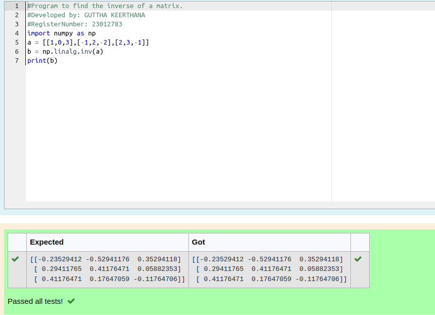

# INVERSE-OF-A-MATRIX
## Aim:
To write a python program to find the inverse of a matrix
## Equipment’s required:
1. 	Hardware – PCs
2. 	Anaconda – Python 3.7 Installation / Moodle-Code Runner
## Algorithm:
### Step1 : 
start the program
### Step 2: 
Enter the code appropriately
### Step 3: 
Run the program
### Step 4: 
End the program
## Program:
```
#Program to find the inverse of a matrix.
#Developed by: GUTTHA KEERTHANA
#RegisterNumber: 23012783
import numpy as np
a = [[1,0,3],[-1,2,-2],[2,3,-1]]
b = np.linalg.inv(a)
print(b)
```
## Output:

## Result:
Thus the inverse of given matrix is successfully solved using python program

 